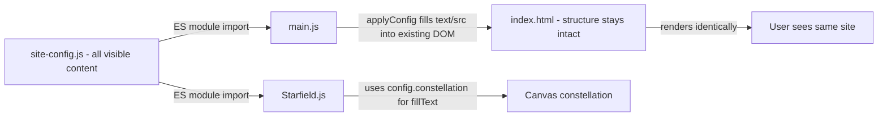

# Central Config File Plan (Updated)

## Core Principles
1. **Config contains ONLY what the user sees** — texts, headings, paragraphs, image src, audio src, dates, visible emojis, constellation text
2. **Config does NOT contain** — alt attributes, aria-labels, CSS class names, data attributes, structural markup
3. **Zero visual/behavioral changes** — every CSS effect, animation, flip card, hover, sparkle, tilt, lightbox must work identically

---

## Architecture



---

## What Goes In Config (User-Visible Only)

### `meta`
- `title` — page title shown in browser tab
- `favicon` — favicon image path

### `audio`
- `bgmSrc` — background music file path
- `bgmVolume` — volume level (affects what user hears)

### `intro`
- `instruction` — "Blow the candle" heading
- `candlePrompt` — "✨ Make a Wish! ✨" text
- `blowButtonText` — "🎂 Blow the Candle!" button label
- `birthdayText` — "Happy Birthday Tanjila!" heading

### `gift`
- `title` — "A Gift for My Cutie" heading
- `boxImageSrc` — gift box GIF URL (what user sees)
- `hint` — "Tap to open ✨" text
- `message` — the gift reveal message text

### `letter`
- `title` — "A Love Letter" heading
- `sealText` — "Click to Open" label
- `sealLetter` — "T" letter on wax seal (visible gold text)
- `greeting` — "Dear Love," text
- `paragraphs` — array of 7 paragraph strings (the letter body)
- `signoff` — "Forever yours," text
- `signoffName` — "Your stargazer" text

### `countdown`
- `title` — "And I'd choose you in every lifetime" heading
- `subtitle` — "Time drifts so softly..." text
- `startDate` — ISO date string "2018-01-24T00:00:00" (determines what numbers user sees)
- `labels` — object with Years/Months/Days/Hours/Minutes/Seconds (visible label text)
- `footerText` — "Many more years wait for us." text

### `story`
- `title` — "Our Story" heading
- `subtitle` — description paragraph
- `footerText` — "Written in the stars, sealed with love" text
- `items` — array of 6 story card objects, each containing:
  - `side` — "left" or "right" (determines layout, user sees the alternating pattern)
  - `dateIcon` — visible emoji like 💫 ✨ ☀️ 🌌 🌹 💖
  - `date` — visible date text like "January 24, 2018"
  - `title` — visible card title like "Where It All Began"
  - `description` — visible card description paragraph
  - `imageSrc` — front card photo URL (what user sees)
  - `backGifSrc` — back card gif/photo URL (what user sees after flip)
  - `backMessage` — visible text on card back
  - `nodeEmoji` — visible emoji on timeline node
  - `glitchText` — (optional, only on last item) the data-glitch hidden text

### `gallery`
- `title` — "Star Gallery" heading
- `subtitle` — description paragraph
- `items` — array of 6 gallery objects, each containing:
  - `src` — image URL (what user sees)
  - `title` — visible caption title
  - `text` — visible caption description
  - `r`, `x`, `y` — visual rotation/offset values (affects how card looks to user)

### `wish`
- `title` — "Whisper to the Universe" heading
- `subtitle` — description paragraph
- `placeholder` — textarea placeholder text
- `buttonText` — "Send to the Stars ✨" button label
- `googleFormUrl` — form submission URL
- `googleFormField` — form field ID

### `finale`
- `line1` — "This universe is wide and endless..." text
- `line2` — "but its favorite corner, for me," text
- `line3` — "is you" text
- `title` — "Happy Birthday, Tanjila" heading
- `footerText` — "Made with all my heart, just for you" text

### `constellation`
- `line1` — "The Galaxy Shines for You Today" (top line of star constellation after blowing candle)
- `line2` — "My Universe, My Tangerine" (bottom line of star constellation)

### `fallbacks`
- `image` — fallback image path for broken images

---

## What Does NOT Go In Config

These stay hardcoded in HTML/JS because they don't affect what the user sees:
- `alt` attributes on images (screen-reader only, not visible)
- `aria-label` attributes (accessibility only, not visible)
- CSS class names, IDs, data-attributes
- SVG path definitions, gradient colors, shape coordinates
- Structural HTML nesting and wrappers
- Animation timing values in JS (setTimeout durations, intersection observer thresholds)
- Particle colors, burst profile numbers

---

## Implementation Strategy

### 1. `site-config.js` — NEW FILE
Pure data export. No logic. Organized by section with clear comments.

### 2. `index.html` — MODIFIED

**Simple text elements**: Remove hardcoded visible text, add `data-config` attribute:
```
Before: <h1 id="intro-instruction">Blow the candle</h1>
After:  <h1 id="intro-instruction" data-config="intro.instruction"></h1>
```

**Media elements**: Remove hardcoded src, add `data-config-src`:
```
Before: <audio id="bgm" src="bgm.mp3" loop></audio>
After:  <audio id="bgm" data-config-src="audio.bgmSrc" loop></audio>
```

**Letter content**: Keep the `<div class="letter-content">` wrapper in HTML. Remove the `<p>` elements inside. They will be regenerated from `config.letter.paragraphs` array by JS, using the same `letter-greeting`, `letter-para`, `letter-signoff` classes.

**Story timeline**: Keep `<div class="story-timeline">` container and the `<div class="story-tl-line">` inside it. Remove all 6 `<div class="story-item">` blocks (~400 lines). Story items will be generated from `config.story.items` by JS, producing **exactly the same HTML structure** with the same classes, nesting, and data attributes.

**Everything else in HTML stays untouched**: All SVGs, div wrappers, CSS class references, aria attributes, structural elements remain exactly as they are.

### 3. `main.js` — MODIFIED

**Import config:**
```js
import { siteConfig } from "./site-config.js";
```

**Add `applyConfig()` function** (runs first in `window.onload`):
- Walks all `[data-config]` elements → sets `textContent` from config path
- Walks all `[data-config-src]` elements → sets `src` attribute from config path
- Sets `document.title` from `config.meta.title`
- Updates favicon `<link>` href from `config.meta.favicon`
- Injects letter paragraphs into `letter-content-wrapper`
- Generates story timeline items into `story-timeline`
- Replaces hardcoded values: `startDate`, `fallbackImageSrc`, `BGM_BASE_VOLUME`, gallery `items` array, Google Form URL/field

**Story item generation**: `generateStoryItems(config.story.items)` produces HTML string with:
- Same `story-item story-item--left/right` classes based on `side`
- Same `data-story-idx` attribute
- Same inner structure: `story-card-wrap > story-orb-ring + story-card > story-card-inner > story-card-front + story-card-back`
- Same `story-node` with `story-node-core` containing the emoji
- Same `story-spacer` on the appropriate side
- Same `data-tw` attribute on `<time>` element
- Same `story-flip-hint` span
- Same `story-item-ptcl` div
- Same `story-cb-msg-glitch` span with `data-glitch` attribute (when present)
- **alt attributes hardcoded as generic values** (not from config)

**Critical ordering**: `applyConfig()` runs BEFORE `wrapLetterWords()` and `formatBirthdayTextForViewport()` so those functions operate on config-injected text.

---

## Guarantee: Zero Visual/Behavioral Changes

| Feature | How it stays identical |
|---------|------------------------|
| Gift box open animation | Same CSS classes, same JS event handlers, same setTimeout chain |
| Letter wax seal break | Same CSS transition, same `locked` class toggle |
| Letter word-by-word reveal | `wrapLetterWords()` runs after config injects text — same spans, same timing |
| Letter tilt on hover | Same mousemove handler on `letter-tilt-container` |
| Letter sparkle on hover | Same sparkle creation on mousemove |
| Countdown ring animation | Same SVG circles, same `setRingProgress`, same `emitParticles` |
| Story card flip | Same `flipped` class toggle, same CSS 3D transform |
| Story card hover sparkle | Same `story-sparkle` div creation |
| Story typewriter dates | Same `runTypewriter` using `data-tw` attribute |
| Story timeline line fill | Same scroll listener, same height calculation |
| Gallery parallax tilt | Same mousemove handler, same CSS custom properties |
| Gallery lightbox | Same open/close/swipe/keyboard handlers |
| Wish star burst | Same burst profile, same particle pool |
| BGM fade in/out | Same `smoothBgmVolume`, same volume tween |
| Mobile birthday text split | Same `formatBirthdayTextForViewport` regex |
| All CSS animations | Unchanged — CSS files not modified at all |

---

## Files Changed

| File | Action | Key Changes |
|------|--------|-------------|
| `site-config.js` | CREATE | All visible content in one organized object with comments |
| `index.html` | MODIFY | Remove ~500 lines of hardcoded text/story items, add data-config attributes |
| `main.js` | MODIFY | Import config, add applyConfig(), generate story items, replace hardcoded values |
| `Starfield.js` | MODIFY | Import config, replace 2 hardcoded fillText strings with config.constellation.line1/line2 |
| `style.css` | NONE | No changes — all CSS stays identical |
| `css/*.css` | NONE | No changes |
| `Planet.js`, `CometSystem.js`, `MouseTrail.js`, `Nebula.js` | NONE | No visible text in these files |